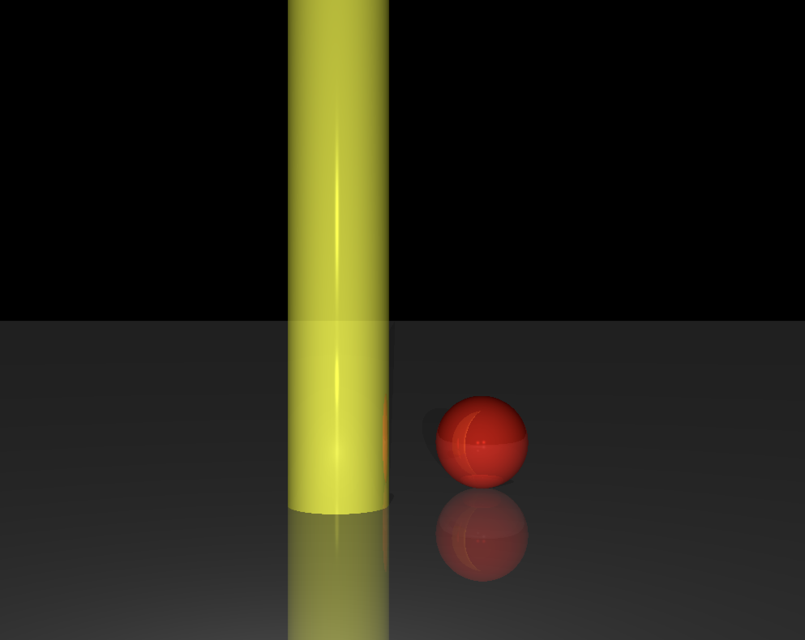
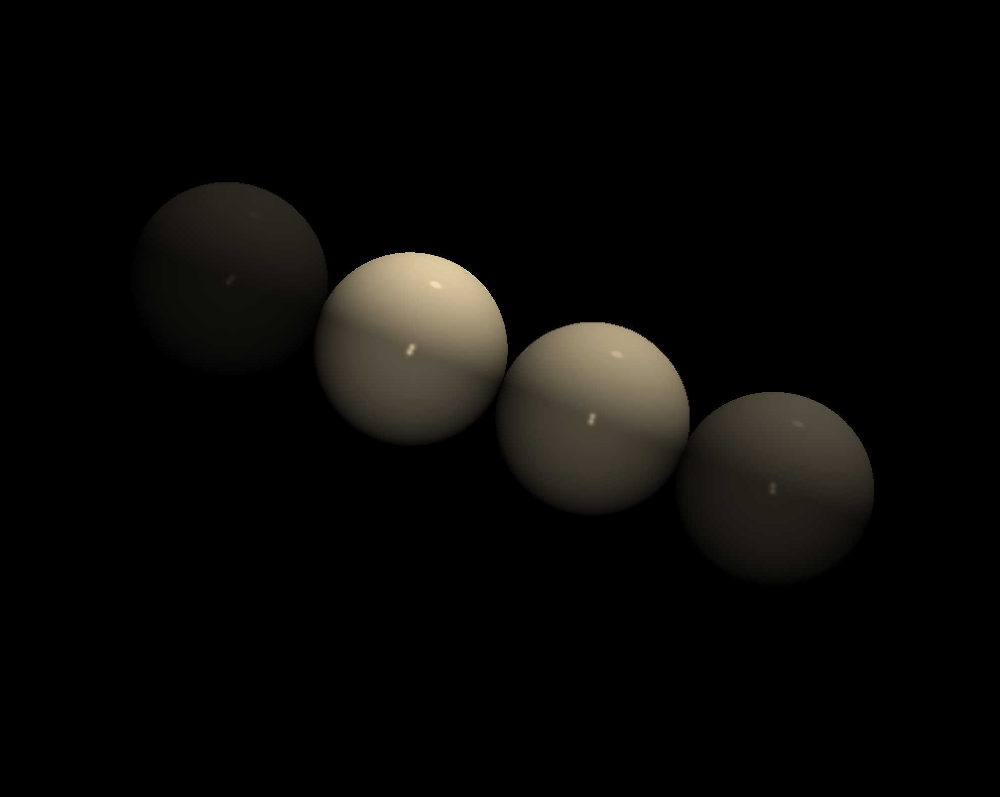
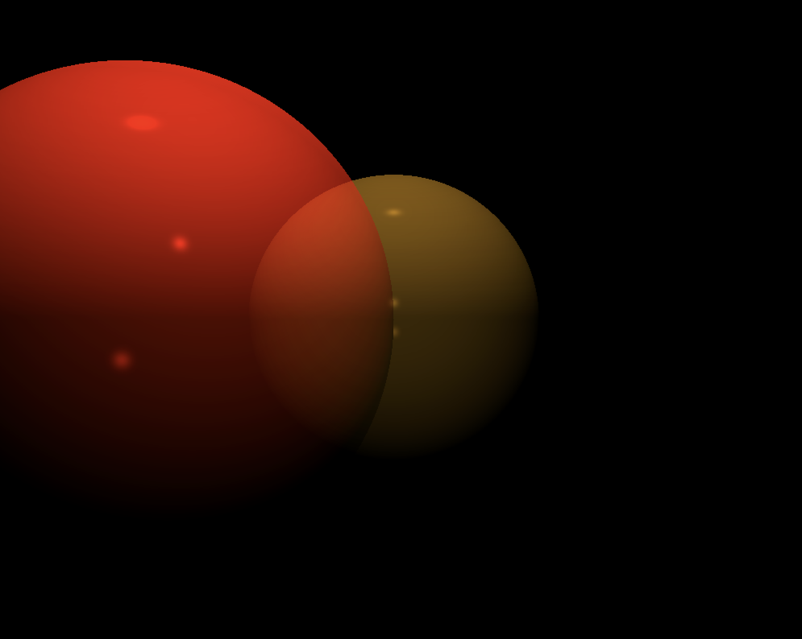

# RT
> Ray Tracer

Implementing the Ray-Tracing method to create a computer generated image.





Bonuses:

• Multi-spots

• Shine effects

• Making screenshot

• Regulating transparency and reflection

• Composed elements

• External files for scene description

• Limited objects

• Ambiance light

• Direct light

• More native elements

• Filters

## Installation

OS X & Linux:

```sh
make && make clean
```

## Usage example

```sh
./RT scenes/[any file]
```

## Meta

Adilyam Tilegenova – [linkedin](https://www.linkedin.com/in/adilyam-tilegenova-5b3180148/) – adilyamt@gmail.com

[https://github.com/Adilyam](https://github.com/Adilyam)

